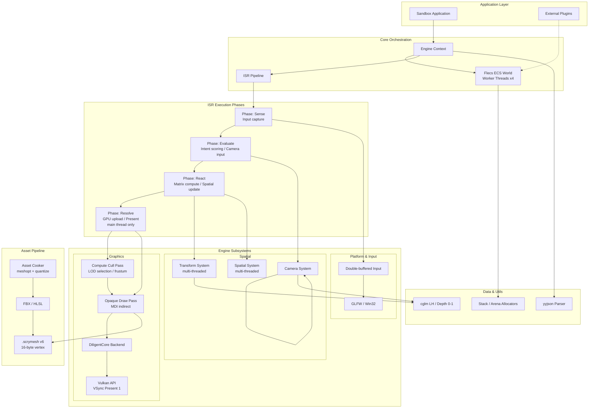

# SCRY ENGINE

### ROADMAP
- [ ] fix vert quant
- [ ] textures
- [ ] materials
- [ ] refactor entities and components
- [ ] find that pesky mem leak
- [ ] tbd

### THEORETICAL ARCHITECHTURE

```mermaid
graph TD
    subgraph "Application Layer"
        Sandbox[Sandbox Application]
        Plugins[External Plugins]
    end

    subgraph "Core Orchestration"
        Context[Engine Context]
        ECS[Flecs ECS World\nWorker Threads x4]
        Pipeline[ISR Pipeline]
    end

    subgraph "ISR Execution Phases"
        Sense[Phase: Sense\nInput capture]
        Evaluate[Phase: Evaluate\nIntent scoring / Camera input]
        React[Phase: React\nMatrix compute / Spatial update]
        Resolve[Phase: Resolve\nGPU upload / Present\nmain thread only]
    end

    subgraph "Engine Subsystems"
        subgraph "Graphics"
            CullPass[Compute Cull Pass\nLOD selection / frustum]
            OpaquePass[Opaque Draw Pass\nMDI indirect]
            Diligent[DiligentCore Backend]
            Vulkan[Vulkan API\nVSync Present 1]
        end

        subgraph "Platform & Input"
            GLFW[GLFW / Win32]
            Input[Double-buffered Input]
        end

        subgraph "Spatial"
            SpatialSys[Spatial System\nmulti-threaded]
            TransformSys[Transform System\nmulti-threaded]
            CameraSys[Camera System]
        end
    end

    subgraph "Asset Pipeline"
        Cooker[Asset Cooker\nmeshopt + quantize]
        Raw[FBX / HLSL]
        Cooked[.scrymesh v6\n16-byte vertex]
    end

    subgraph "Data & Utils"
        JSON[yyjson Parser]
        Math[cglm LH / Depth 0-1]
        Memory[Stack / Arena Allocators]
    end

    %% Relationships
    Sandbox --> Context
    Context --> ECS
    Context --> Pipeline
    Plugins -.-> ECS

    Pipeline --> Sense
    Sense --> Evaluate
    Evaluate --> React
    React --> Resolve

    %% System Mapping
    Sense --> Input
    Input --> GLFW
    Evaluate --> CameraSys
    React --> TransformSys
    React --> SpatialSys
    CameraSys --> CameraSys
    Resolve --> CullPass
    Resolve --> OpaquePass
    CullPass --> OpaquePass
    OpaquePass --> Diligent
    Diligent --> Vulkan

    %% Data Flow
    Cooker --> Raw
    Raw --> Cooked
    OpaquePass --> Cooked
    ECS --> Memory
    TransformSys --> Math
    CameraSys --> Math
    Context --> JSON
```