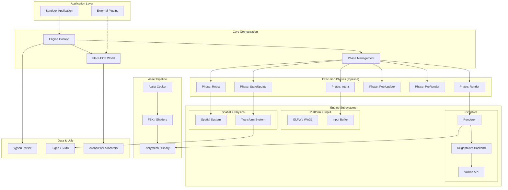

# Scry Engine

Scry is a modern, high-performance 3D engine built with a focus on data-oriented design and modern graphics APIs. It leverages an Entity Component System (ECS) to manage complexity and maximize hardware utilization.

## Architecture

The engine is designed around a decoupled, modular architecture where data flows through clearly defined execution phases.



## Core Subsystems

### 1. ECS (Entity Component System)
Scry uses **Flecs** as its backbone. Almost all engine logic is implemented as ECS systems, ensuring high cache locality and predictable execution.

### 2. Graphics (Vulkan & DiligentCore)
The rendering engine is powered by **DiligentCore** with a focus on Vulkan. Key features include:
- **GPU-Driven Culling**: Frustum culling performed on the GPU via compute shaders.
- **Megabuffers**: Large, centralized vertex and index buffers to minimize draw call overhead.
- **LOD Management**: Built-in support for multiple levels of detail with distance-based switching.
- **Bindless Rendering**: Modern resource management for high performance.

### 3. Asset Pipeline
Assets are processed by a dedicated **Cooker** tool before use.
- **Input**: Raw formats like FBX (via Assimp) and HLSL shaders.
- **Output**: Optimized `.scrymesh` binary blobs containing LOD data and GPU-ready structures.
- **Automatic Cooking**: The CMake build system automatically triggers the cooker when raw assets change.

### 4. Platform & Input
Uses **GLFW** for cross-platform windowing and event handling. Input is processed into a double-buffered `InputBuffer`, allowing systems to read consistent input states throughout a frame.

### 5. Memory Management
Scry employs custom **Arena** and **Pool** allocators to minimize heap fragmentation and ensure high-performance memory operations during runtime.

## Building the Engine

### Prerequisites
- **CMake** (3.19 or higher)
- **C++20** compatible compiler (MSVC, GCC, or Clang)
- **Vulkan SDK**

### Build Instructions
```bash
# 1. Clone the repository
git clone https://github.com/your-repo/scry.git
cd scry

# 2. Configure the project
cmake -S . -B build

# 3. Build the engine and sandbox
cmake --build build --config Release
```

The build process will automatically:
1. Download all third-party dependencies (Flecs, DiligentCore, GLFW, etc.).
2. Build the Asset Cooker.
3. "Cook" the included raw assets into the `bin` directory.

## Running the Sandbox
After building, you can find the sandbox executable in `build/bin/scry_sandbox.exe` (on Windows).

---
*Built with Scry Engine 1.0.0*
